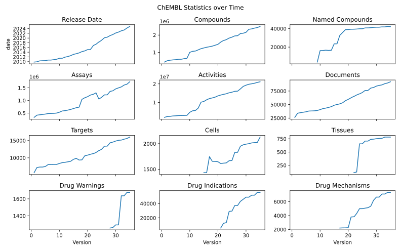

<!--
<p align="center">
  
</p>
-->

<h1 align="center">
  ChEMBL Downloader
</h1>

<p align="center">
    <a href="https://github.com/cthoyt/chembl-downloader/actions/workflows/tests.yml">
        </a>
    <a href="https://pypi.org/project/chembl_downloader">
        </a>
    <a href="https://pypi.org/project/chembl_downloader">
        </a>
    <a href="https://github.com/cthoyt/chembl-downloader/blob/main/LICENSE">
        </a>
    <a href='https://chembl_downloader.readthedocs.io/en/latest/?badge=latest'>
        </a>
    <a href="https://codecov.io/gh/cthoyt/chembl-downloader/branch/main">
        </a>  
    <a href="https://github.com/cthoyt/cookiecutter-python-package">
        </a>
    <a href="https://github.com/astral-sh/ruff">
        </a>
    <a href="https://github.com/cthoyt/chembl-downloader/blob/main/.github/CODE_OF_CONDUCT.md">
        </a>
    <a href="https://zenodo.org/badge/latestdoi/390113187">
        </a>
    <a href="https://joss.theoj.org/papers/bf700e4bdbef157f982fd3944761414a">
        </a>
</p>

Reproducibly download, open, parse, and query ChEMBL.

Don't worry about downloading/extracting ChEMBL or versioning - just use
`chembl_downloader` to write code that knows how to download it and use it
automatically.

## 💪 Getting Started

Download an extract the SQLite dump using the following:

```python
import chembl_downloader

path = chembl_downloader.download_extract_sqlite(version='28')
```

After it's been downloaded and extracted once, it's smart and does not need to
download again. It gets stored using
[`pystow`](https://github.com/cthoyt/pystow) automatically in the
`~/.data/chembl` directory.

Full technical documentation can be found on
[ReadTheDocs](https://chembl-downloader.readthedocs.io). Tutorials can be found
in Jupyter notebooks in the [notebooks/](notebooks/) directory of the
repository.

### Download the Latest Version

You can modify the previous code slightly by omitting the `version` keyword
argument to automatically find the latest version of ChEMBL:

```python
import chembl_downloader

path = chembl_downloader.download_extract_sqlite()
```

The `version` keyword argument is available for all functions in this package
(e.g., including `connect()`, `cursor()`, and `query()`), but will be omitted
below for brevity.

### Automatically Connect to SQLite

Inside the archive is a single SQLite database file. Normally, people manually
untar this folder then do something with the resulting file. Don't do this, it's
not reproducible! Instead, the file can be downloaded and a connection can be
opened automatically with:

```python
import chembl_downloader

with chembl_downloader.connect() as conn:
    with conn.cursor() as cursor:
        cursor.execute(...)  # run your query string
        rows = cursor.fetchall()  # get your results
```

The `cursor()` function provides a convenient wrapper around this operation:

```python
import chembl_downloader

with chembl_downloader.cursor() as cursor:
    cursor.execute(...)  # run your query string
    rows = cursor.fetchall()  # get your results
```

### Run a Query and Get a Pandas DataFrame

The most powerful function is `query()` which builds on the previous `connect()`
function in combination with
[`pandas.read_sql`](https://pandas.pydata.org/docs/reference/api/pandas.read_sql.html)
to make a query and load the results into a pandas DataFrame for any downstream
use.

```python
import chembl_downloader

sql = """
SELECT
    MOLECULE_DICTIONARY.chembl_id,
    MOLECULE_DICTIONARY.pref_name
FROM MOLECULE_DICTIONARY
JOIN COMPOUND_STRUCTURES ON MOLECULE_DICTIONARY.molregno == COMPOUND_STRUCTURES.molregno
WHERE molecule_dictionary.pref_name IS NOT NULL
LIMIT 5
"""

df = chembl_downloader.query(sql)
df.to_csv(..., sep='\t', index=False)
```

Suggestion 1: use `pystow` to make a reproducible file path that's portable to
other people's machines (e.g., it doesn't have your username in the path).

Suggestion 2: RDKit is now pip-installable with `pip install rdkit-pypi`, which
means most users don't have to muck around with complicated conda environments
and configurations. One of the powerful but understated tools in RDKit is the
[rdkit.Chem.PandasTools](https://rdkit.org/docs/source/rdkit.Chem.PandasTools.html)
module.

### SDF Usage

#### Access an RDKit supplier over entries in the SDF dump

This example is a bit more fit-for-purpose than the last two. The `supplier()`
function makes sure that the latest SDF dump is downloaded and loads it from the
gzip file into a `rdkit.Chem.ForwardSDMolSupplier` using a context manager to
make sure the file doesn't get closed until after parsing is done. Like the
previous examples, it can also explicitly take a `version`.

```python
from rdkit import Chem

import chembl_downloader

with chembl_downloader.supplier() as suppl:
    data = []
    for i, mol in enumerate(suppl):
        if mol is None or mol.GetNumAtoms() > 50:
            continue
        fp = Chem.PatternFingerprint(mol, fpSize=1024, tautomerFingerprints=True)
        smi = Chem.MolToSmiles(mol)
        data.append((smi, fp))
```

This example was adapted from Greg Landrum's RDKit blog post on
[generalized substructure search](https://greglandrum.github.io/rdkit-blog/tutorial/substructure/2021/08/03/generalized-substructure-search.html).

#### Iterate over SMILES

This example uses the `supplier()` method and RDKit to get SMILES strings from
molecules in ChEMBL's SDF file. If you want direct access to the RDKit molecule
objects, use `supplier()`.

```python
import chembl_downloader

for smiles in chembl_downloader.iterate_smiles():
    print(smiles)
```

### Get an RDKit substructure library

Building on the `supplier()` function, the `get_substructure_library()` makes
the preparation of a
[substructure library](https://www.rdkit.org/docs/cppapi/classRDKit_1_1SubstructLibrary.html)
automated and reproducible. Additionally, it caches the results of the build,
which takes on the order of tens of minutes, only has to be done once and future
loading from a pickle object takes on the order of seconds.

The implementation was inspired by Greg Landrum's RDKit blog post,
[Some new features in the SubstructLibrary](https://greglandrum.github.io/rdkit-blog/tutorial/substructure/2021/12/20/substructlibrary-search-order.html).
The following example shows how it can be used to accomplish some of the first
tasks presented in the post:

```python
from rdkit import Chem

import chembl_downloader

library = chembl_downloader.get_substructure_library()
query = Chem.MolFromSmarts('[O,N]=C-c:1:c:c:n:c:c:1')
matches = library.GetMatches(query)
```

### Morgan Fingerprints Usage

#### Get the Morgan Fingerprint file

ChEMBL makes a file containing pre-computed 2048 bit radius 2 morgan
fingerprints for each molecule available. It can be downloaded using:

```python
import chembl_downloader

path = chembl_downloader.download_fps()
```

The `version` and other keyword arguments are also valid for this function.

#### Load fingerprints with [`chemfp`](https://chemfp.com/)

The following wraps the `download_fps` function with `chemfp`'s fingerprint
loader:

```python
import chembl_downloader

arena = chembl_downloader.chemfp_load_fps()
```

The `version` and other keyword arguments are also valid for this function. More
information on working with the `arena` object can be found
[here](https://chemfp.readthedocs.io/en/latest/using-api.html#working-with-a-fingerprintarena).

### Command Line Interface

After installing, run the following CLI command to ensure it and send the path
to stdout:

```console
$ chembl_downloader download
```

Use the `test` subcommand to show two example queries:

```console
$ chembl_downloader test
```

## Configuration

If you want to store the data elsewhere using `pystow` (e.g., in
[`pyobo`](https://github.com/pyobo/pyobo) I also keep a copy of this file), you
can use the `prefix` argument.

```python
import chembl_downloader

# It gets downloaded/extracted to
# ~/.data/pyobo/raw/chembl/29/chembl_29/chembl_29_sqlite/chembl_29.db
path = chembl_downloader.download_extract_sqlite(prefix=['pyobo', 'raw', 'chembl'])
```

See the `pystow`
[documentation](https://github.com/cthoyt/pystow#%EF%B8%8F-configuration) on
configuring the storage location further.

The `prefix` keyword argument is available for all functions in this package
(e.g., including `connect()`, `cursor()`, and `query()`).

## 🚀 Installation

The most recent release can be installed from
[PyPI](https://pypi.org/project/chembl_downloader/) with uv:

```console
$ uv pip install chembl_downloader
```

or with pip:

```console
$ python3 -m pip install chembl_downloader
```

The most recent code and data can be installed directly from GitHub with uv:

```console
$ uv pip install git+https://github.com/cthoyt/chembl-downloader.git
```

or with pip:

```console
$ python3 -m pip install git+https://github.com/cthoyt/chembl-downloader.git
```

## Users

See
[who's using `chembl-downloader`](https://github.com/search?q=chembl_downloader+-user%3Acthoyt+-is%3Afork&type=code).

## Statistics and Compatibility

`chembl-downloader` is compatible with all versions of ChEMBL (with a few
caveats in the SQLite dumps of the first few versions, see discussion
[here](https://github.com/cthoyt/chembl-downloader/issues/20)). The following
table can be generated with
`chembl_downloader history && chembl_downloader history-draw`. These data can be
found as a TSV in [docs/\_data/summary.tsv](docs/_data/summary.tsv).

| Version | Date       | Compounds | Named Compounds |    Assays | Activities | Documents | Targets | Cells | Tissues | Drug Warnings | Drug Indications | Drug Mechanisms |
| ------: | ---------- | --------: | --------------: | --------: | ---------: | --------: | ------: | ----: | ------: | ------------: | ---------------: | --------------: |
|      35 | 2024-12-01 | 2,496,335 |          42,231 | 1,740,546 | 21,123,501 |    92,121 |  16,003 | 2,129 |     782 |         1,676 |           55,442 |           7,330 |
|      34 | 2024-03-28 | 2,431,025 |          42,387 | 1,644,390 | 20,772,701 |    89,892 |  15,598 | 2,023 |     782 |         1,676 |           55,442 |           7,330 |
|      33 | 2023-05-31 | 2,399,743 |          41,923 | 1,610,596 | 20,334,684 |    88,630 |  15,398 | 2,021 |     782 |         1,636 |           51,582 |           7,098 |
|      32 | 2023-01-26 | 2,354,965 |          41,923 | 1,536,903 | 20,038,828 |    86,361 |  15,139 | 2,015 |     759 |         1,636 |           51,582 |           7,098 |
|      31 | 2022-07-12 | 2,331,700 |          41,585 | 1,498,681 | 19,780,369 |    85,431 |  15,072 | 2,000 |     757 |         1,293 |           48,816 |           6,656 |
|      30 | 2022-02-22 | 2,157,379 |          41,549 | 1,458,215 | 19,286,751 |    84,092 |  14,855 | 1,991 |     752 |         1,293 |           48,816 |           6,656 |
|      29 | 2021-07-01 | 2,105,464 |          41,383 | 1,383,553 | 18,635,916 |    81,544 |  14,554 | 1,978 |     743 |         1,262 |           45,902 |           6,202 |
|      28 | 2021-01-15 | 2,086,898 |          41,049 | 1,358,549 | 17,276,334 |    80,480 |  14,347 | 1,950 |     739 |         1,256 |           42,988 |           5,347 |
|      27 | 2020-05-18 | 1,961,462 |          40,834 | 1,221,361 | 16,066,124 |    76,086 |  13,382 | 1,831 |     707 |             0 |           37,259 |           5,134 |
|      26 | 2020-02-14 | 1,950,765 |          40,822 | 1,221,311 | 15,996,368 |    76,076 |  13,377 | 1,830 |     707 |             0 |           37,259 |           5,070 |
|      25 | 2019-02-01 | 1,879,206 |          39,885 | 1,125,387 | 15,504,603 |    72,271 |  12,482 | 1,670 |     655 |             0 |           29,457 |           4,992 |
|    24.1 | 2018-05-01 | 1,828,820 |          39,877 | 1,060,283 | 15,207,914 |    69,861 |  12,091 | 1,667 |     655 |             0 |           29,163 |           4,992 |
|      24 | 2018-05-01 | 1,828,820 |          39,877 | 1,060,283 | 15,207,914 |    69,861 |  12,091 | 1,667 |     655 |             0 |           29,163 |           4,992 |
|      23 | 2017-05-18 | 1,735,442 |          39,584 | 1,302,147 | 14,675,320 |    67,722 |  11,538 | 1,624 |     125 |             0 |           13,504 |           4,305 |
|    22.1 | 2016-11-17 | 1,686,695 |          39,422 | 1,246,683 | 14,371,197 |    65,213 |  11,224 | 1,619 |     111 |             0 |           12,573 |           3,834 |
|      22 | 2016-09-28 | 1,686,695 |          39,422 | 1,246,132 | 14,371,219 |    65,213 |  11,224 | 1,619 |     111 |             0 |           12,573 |           3,834 |
|      21 | 2015-02-12 | 1,592,191 |          39,347 | 1,212,831 | 13,968,617 |    62,502 |  11,019 | 1,612 |       0 |             0 |            5,951 |           3,799 |
|      20 | 2015-02-03 | 1,463,270 |          39,016 | 1,148,942 | 13,520,737 |    59,610 |  10,774 | 1,647 |       0 |             0 |                0 |           2,266 |
|      19 | 2014-07-23 | 1,411,786 |          38,910 | 1,106,285 | 12,843,338 |    57,156 |  10,579 | 1,653 |       0 |             0 |                0 |           2,239 |
|      18 | 2014-04-02 | 1,359,508 |          35,817 | 1,042,374 | 12,419,715 |    53,298 |   9,414 | 1,655 |       0 |             0 |                0 |           2,233 |
|      17 | 2013-09-16 | 1,324,941 |          32,692 |   734,201 | 12,077,491 |    51,277 |   9,356 | 1,746 |       0 |             0 |                0 |           2,213 |
|      16 | 2013-05-15 | 1,295,510 |          23,532 |   712,836 | 11,420,351 |    50,095 |   9,844 | 1,432 |       0 |             0 |                0 |               0 |
|      15 | 2013-01-30 | 1,254,575 |          23,528 |   679,259 | 10,509,572 |    48,735 |   9,570 | 1,432 |       0 |             0 |                0 |               0 |
|      14 | 2012-07-18 | 1,213,242 |          16,573 |   644,734 | 10,129,256 |    46,133 |   9,003 |     0 |       0 |             0 |                0 |               0 |
|      13 | 2012-02-29 | 1,143,682 |          16,397 |   617,681 |  6,933,068 |    44,682 |   8,845 |     0 |       0 |             0 |                0 |               0 |
|      12 | 2011-11-30 | 1,077,189 |          16,658 |   596,122 |  5,654,847 |    43,418 |   8,703 |     0 |       0 |             0 |                0 |               0 |
|      11 | 2011-06-07 | 1,060,258 |          16,264 |   582,982 |  5,479,146 |    42,516 |   8,603 |     0 |       0 |             0 |                0 |               0 |
|      10 | 2011-06-07 | 1,000,468 |          16,159 |   534,391 |  4,668,202 |    40,624 |   8,372 |     0 |       0 |             0 |                0 |               0 |
|       9 | 2011-01-04 |         0 |           3,746 |   499,867 |  3,030,317 |    39,094 |   8,091 |     0 |       0 |             0 |                0 |               0 |
|       8 | 2010-11-05 |   636,269 |               0 |   488,898 |  2,973,034 |    38,462 |   8,088 |     0 |       0 |             0 |                0 |               0 |
|       7 | 2010-09-03 |   602,500 |               0 |   485,095 |  2,948,069 |    38,204 |   8,078 |     0 |       0 |             0 |                0 |               0 |
|       6 | 2010-09-03 |   600,625 |               0 |   481,752 |  2,925,588 |    38,029 |   8,054 |     0 |       0 |             0 |                0 |               0 |
|       5 | 2010-06-07 |   578,715 |               0 |   459,823 |  2,787,240 |    36,624 |   7,493 |     0 |       0 |             0 |                0 |               0 |
|       4 | 2010-05-26 |   565,245 |               0 |   446,645 |  2,705,136 |    35,821 |   7,330 |     0 |       0 |             0 |                0 |               0 |
|       3 | 2010-04-30 |   547,133 |               0 |   432,022 |  2,490,742 |    34,982 |   7,330 |     0 |       0 |             0 |                0 |               0 |
|       2 | 2009-12-07 |   517,261 |               0 |   416,284 |  2,404,622 |    33,956 |   7,192 |     0 |       0 |             0 |                0 |               0 |
|       1 | 2009-10-28 |   440,055 |               0 |   329,250 |  1,936,969 |    26,299 |   5,694 |     0 |       0 |             0 |                0 |               0 |

Or, as a chart:



## 👐 Contributing

Contributions, whether filing an issue, making a pull request, or forking, are
appreciated. See
[CONTRIBUTING.md](https://github.com/cthoyt/chembl-downloader/blob/master/.github/CONTRIBUTING.md)
for more information on getting involved.

## 👋 Attribution

### ⚖️ License

The code in this package is licensed under the MIT License.

### 📖 Citation

> [Improving reproducibility of cheminformatics workflows with chembl-downloader](https://doi.org/10.48550/arXiv.2507.17783)
> Hoyt, C.T. (2025) _arXiv_, 2507.17783

```bibtex
@article{hoyt2025chembl,
   title={Improving reproducibility of cheminformatics workflows with chembl-downloader},
   author={Charles Tapley Hoyt},
   year={2025},
   eprint={2507.17783},
   archivePrefix={arXiv},
   primaryClass={q-bio.QM},
   doi={https://doi.org/10.48550/arXiv.2507.17783}
   url={https://arxiv.org/abs/2507.17783},
}
```

<!--
### 🎁 Support

This project has been supported by the following organizations (in alphabetical order):

- [Biopragmatics Lab](https://biopragmatics.github.io)

-->

<!--
### 💰 Funding

This project has been supported by the following grants:

| Funding Body  | Program                                                      | Grant Number |
|---------------|--------------------------------------------------------------|--------------|
| Funder        | [Grant Name (GRANT-ACRONYM)](https://example.com/grant-link) | ABCXYZ       |
-->

### 🍪 Cookiecutter

This package was created with
[@audreyfeldroy](https://github.com/audreyfeldroy)'s
[cookiecutter](https://github.com/cookiecutter/cookiecutter) package using
[@cthoyt](https://github.com/cthoyt)'s
[cookiecutter-snekpack](https://github.com/cthoyt/cookiecutter-snekpack)
template.

## 🛠️ For Developers

<details>
  <summary>See developer instructions</summary>

The final section of the README is for if you want to get involved by making a
code contribution.

### Development Installation

To install in development mode, use the following:

```console
$ git clone git+https://github.com/cthoyt/chembl-downloader.git
$ cd chembl-downloader
$ uv pip install -e .
```

Alternatively, install using pip:

```console
$ python3 -m pip install -e .
```

### Updating Package Boilerplate

This project uses `cruft` to keep boilerplate (i.e., configuration, contribution
guidelines, documentation configuration) up-to-date with the upstream
cookiecutter package. Install cruft with either `uv tool install cruft` or
`python3 -m pip install cruft` then run:

```console
$ cruft update
```

More info on Cruft's update command is available
[here](https://github.com/cruft/cruft?tab=readme-ov-file#updating-a-project).

### 🥼 Testing

After cloning the repository and installing `tox` with
`uv tool install tox --with tox-uv` or `python3 -m pip install tox tox-uv`, the
unit tests in the `tests/` folder can be run reproducibly with:

```console
$ tox -e py
```

Additionally, these tests are automatically re-run with each commit in a
[GitHub Action](https://github.com/cthoyt/chembl-downloader/actions?query=workflow%3ATests).

### 📖 Building the Documentation

The documentation can be built locally using the following:

```console
$ git clone git+https://github.com/cthoyt/chembl-downloader.git
$ cd chembl-downloader
$ tox -e docs
$ open docs/build/html/index.html
```

The documentation automatically installs the package as well as the `docs` extra
specified in the [`pyproject.toml`](pyproject.toml). `sphinx` plugins like
`texext` can be added there. Additionally, they need to be added to the
`extensions` list in [`docs/source/conf.py`](docs/source/conf.py).

The documentation can be deployed to [ReadTheDocs](https://readthedocs.io) using
[this guide](https://docs.readthedocs.io/en/stable/intro/import-guide.html). The
[`.readthedocs.yml`](.readthedocs.yml) YAML file contains all the configuration
you'll need. You can also set up continuous integration on GitHub to check not
only that Sphinx can build the documentation in an isolated environment (i.e.,
with `tox -e docs-test`) but also that
[ReadTheDocs can build it too](https://docs.readthedocs.io/en/stable/pull-requests.html).

#### Configuring ReadTheDocs

1. Log in to ReadTheDocs with your GitHub account to install the integration at
   https://readthedocs.org/accounts/login/?next=/dashboard/
2. Import your project by navigating to https://readthedocs.org/dashboard/import
   then clicking the plus icon next to your repository
3. You can rename the repository on the next screen using a more stylized name
   (i.e., with spaces and capital letters)
4. Click next, and you're good to go!

### 📦 Making a Release

#### Configuring Zenodo

[Zenodo](https://zenodo.org) is a long-term archival system that assigns a DOI
to each release of your package.

1. Log in to Zenodo via GitHub with this link:
   https://zenodo.org/oauth/login/github/?next=%2F. This brings you to a page
   that lists all of your organizations and asks you to approve installing the
   Zenodo app on GitHub. Click "grant" next to any organizations you want to
   enable the integration for, then click the big green "approve" button. This
   step only needs to be done once.
2. Navigate to https://zenodo.org/account/settings/github/, which lists all of
   your GitHub repositories (both in your username and any organizations you
   enabled). Click the on/off toggle for any relevant repositories. When you
   make a new repository, you'll have to come back to this

After these steps, you're ready to go! After you make "release" on GitHub (steps
for this are below), you can navigate to
https://zenodo.org/account/settings/github/repository/cthoyt/chembl-downloader
to see the DOI for the release and link to the Zenodo record for it.

#### Registering with the Python Package Index (PyPI)

You only have to do the following steps once.

1. Register for an account on the
   [Python Package Index (PyPI)](https://pypi.org/account/register)
2. Navigate to https://pypi.org/manage/account and make sure you have verified
   your email address. A verification email might not have been sent by default,
   so you might have to click the "options" dropdown next to your address to get
   to the "re-send verification email" button
3. 2-Factor authentication is required for PyPI since the end of 2023 (see this
   [blog post from PyPI](https://blog.pypi.org/posts/2023-05-25-securing-pypi-with-2fa/)).
   This means you have to first issue account recovery codes, then set up
   2-factor authentication
4. Issue an API token from https://pypi.org/manage/account/token

#### Configuring your machine's connection to PyPI

You have to do the following steps once per machine.

```console
$ uv tool install keyring
$ keyring set https://upload.pypi.org/legacy/ __token__
$ keyring set https://test.pypi.org/legacy/ __token__
```

Note that this deprecates previous workflows using `.pypirc`.

#### Uploading to PyPI

After installing the package in development mode and installing `tox` with
`uv tool install tox --with tox-uv` or `python3 -m pip install tox tox-uv`, run
the following from the console:

```console
$ tox -e finish
```

This script does the following:

1. Uses [bump-my-version](https://github.com/callowayproject/bump-my-version) to
   switch the version number in the `pyproject.toml`, `CITATION.cff`,
   `src/chembl_downloader/version.py`, and
   [`docs/source/conf.py`](docs/source/conf.py) to not have the `-dev` suffix
2. Packages the code in both a tar archive and a wheel using
   [`uv build`](https://docs.astral.sh/uv/guides/publish/#building-your-package)
3. Uploads to PyPI using
   [`uv publish`](https://docs.astral.sh/uv/guides/publish/#publishing-your-package).
4. Push to GitHub. You'll need to make a release going with the commit where the
   version was bumped.
5. Bump the version to the next patch. If you made big changes and want to bump
   the version by minor, you can use `tox -e bumpversion -- minor` after.

#### Releasing on GitHub

1. Navigate to https://github.com/cthoyt/chembl-downloader/releases/new to draft
   a new release
2. Click the "Choose a Tag" dropdown and select the tag corresponding to the
   release you just made
3. Click the "Generate Release Notes" button to get a quick outline of recent
   changes. Modify the title and description as you see fit
4. Click the big green "Publish Release" button

This will trigger Zenodo to assign a DOI to your release as well.

</details>
